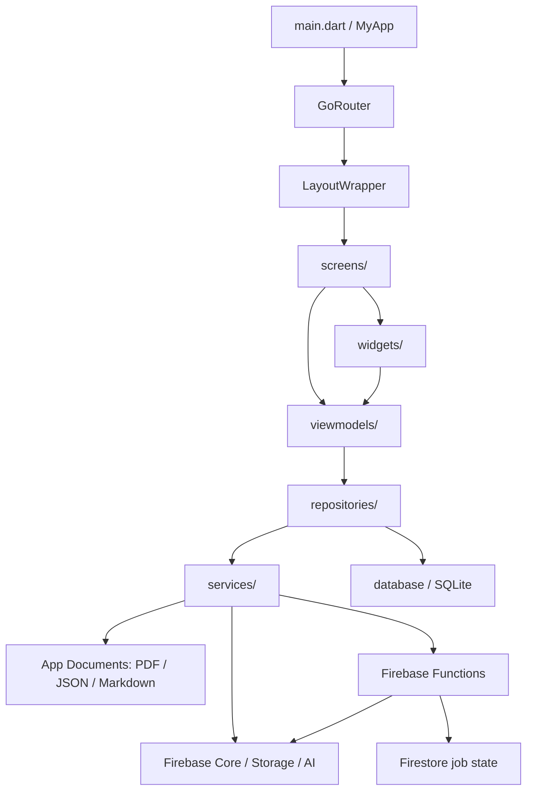
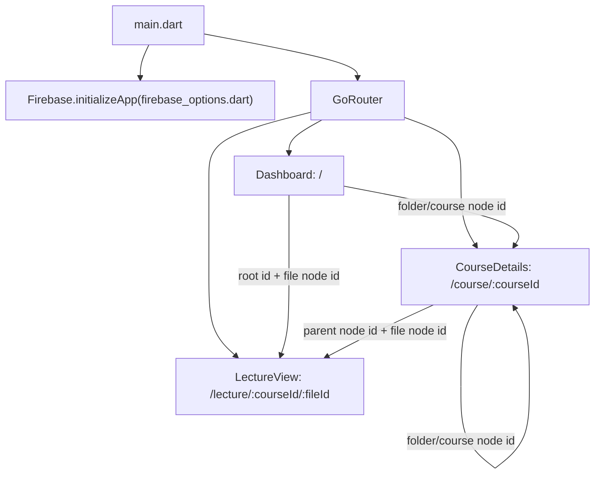
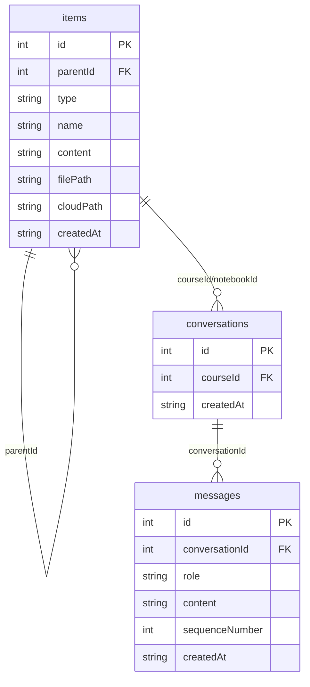
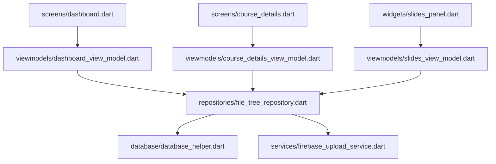
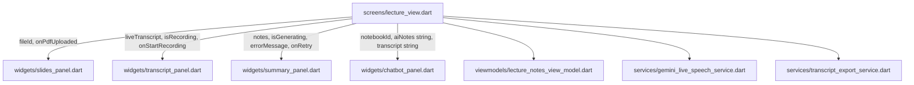
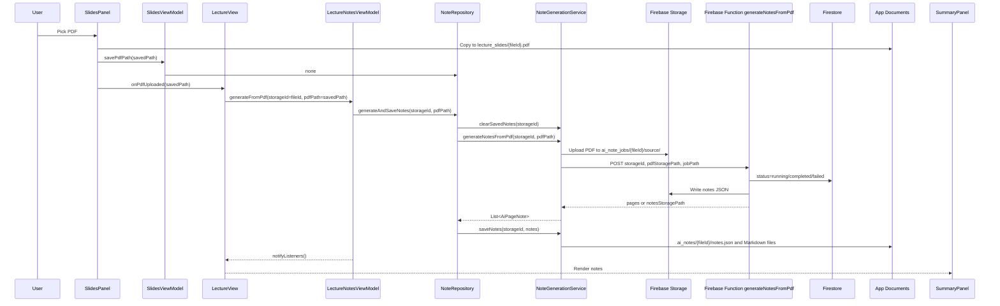
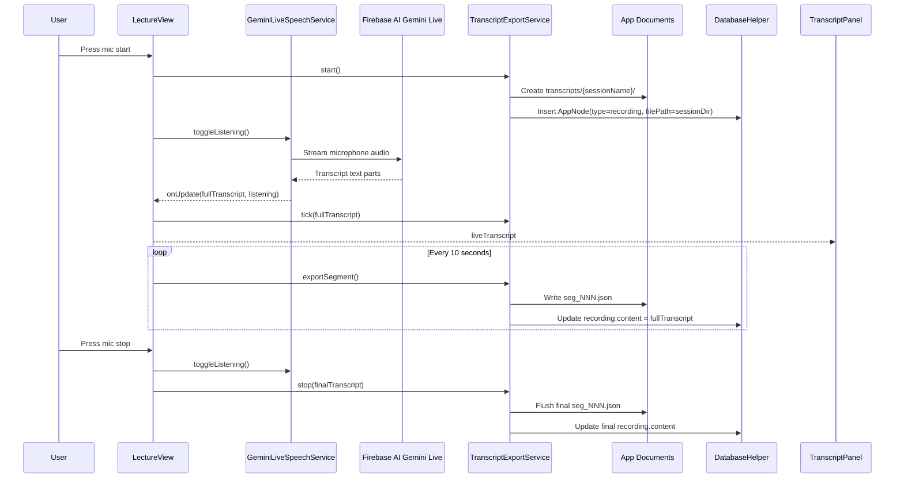
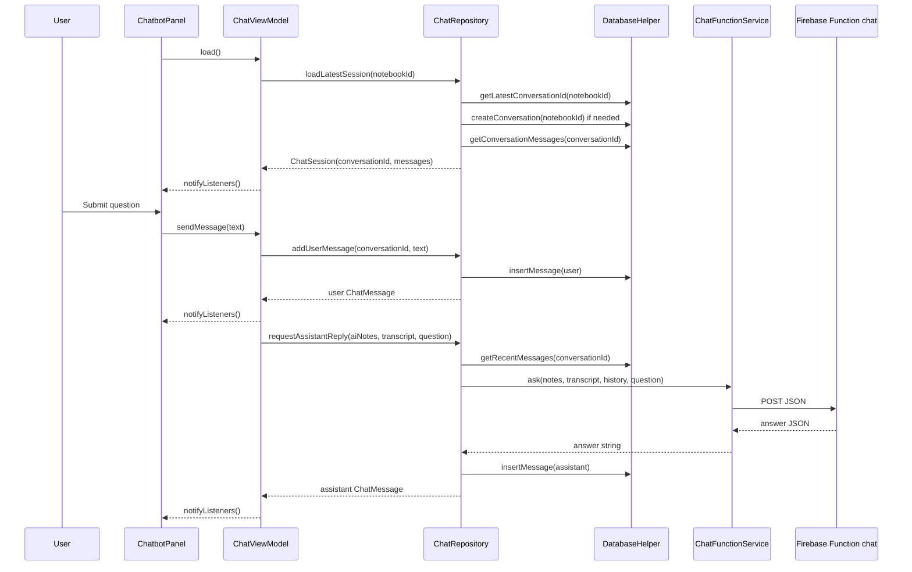
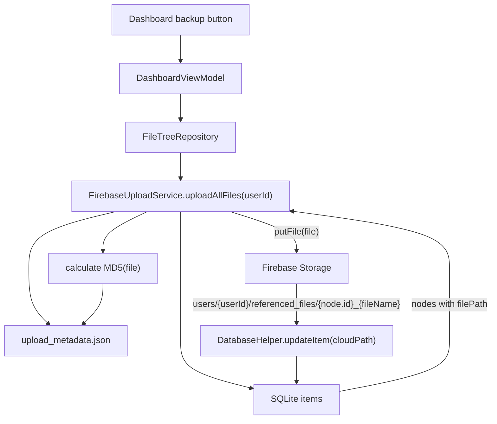

# Project Architecture

This document explains the current Flutter app structure and runtime data flow.

## 1. High-Level Layering

The project uses lightweight MVVM with manual `ChangeNotifier` listeners. No
Provider/Riverpod dependency has been added.



Recommended boundaries:

- `models/`: plain data objects.
- `services/`: low-level integrations, HTTP, local file IO, Firebase SDKs.
- `repositories/`: application workflows that combine DB, cache, and services.
- `viewmodels/`: screen/panel state using `ChangeNotifier`.
- `screens/`: route-level page composition.
- `widgets/`: reusable UI and panel UI.
- `database/`: SQLite schema and low-level DB access.
- `functions/`: Firebase Functions backend runtime.

The old `python_server` folder is historical reference code only. Flutter no
longer calls it at runtime.

## 2. Navigation



Route parameters:

- `courseId`: string route parameter, usually an `items.id`.
- `fileId`: string route parameter, usually an `items.id` for a notebook,
  recording, or lecture file item.

## 3. Local SQLite Model

SQLite is accessed through `DatabaseHelper`.



Important model classes:

- `AppNode`: maps to `items`.
- `ChatMessage`: maps to `messages`.

Important `items.type` values:

- `system_folder`
- `folder`
- `course`
- `notebook`
- `recording`
- `ai_note`

## 4. Dashboard, Course Browser, and File Path Flow

Dashboard and course browsing have been moved into MVVM.



Responsibilities:

- `DashboardViewModel`: root folder load, root children, create/rename/delete,
  backup progress.
- `CourseDetailsViewModel`: folder/course load, children, create/rename/delete.
- `SlidesViewModel`: load/save the PDF `filePath` for a lecture item.
- `FileTreeRepository`: coordinates SQLite tree operations and manual Firebase
  backup.
- `DatabaseHelper`: low-level SQL only.

## 5. Lecture Workspace Overview

`LectureView` coordinates panel visibility/order, recording lifecycle, and the
AI notes viewmodel.



Transcript recording/export is still coordinated directly by `LectureView`.
Moving it into `TranscriptViewModel` and `TranscriptRepository` is the main
remaining MVVM follow-up.

## 6. PDF Upload and AI Notes Flow



Function request:

```json
{
  "storageId": "123",
  "pdfStoragePath": "ai_note_jobs/123/source/...",
  "jobPath": "ai_note_jobs/123",
  "requestedAt": "2026-06-03T02:00:00.000Z"
}
```

Function response:

```json
{
  "status": "completed",
  "jobPath": "ai_note_jobs/123",
  "notesStoragePath": "ai_note_jobs/123/notes/notes.json",
  "pages": [
    {
      "page_number": 1,
      "markdown": "..."
    }
  ]
}
```

## 7. Transcript Flow

Transcript is not yet moved into MVVM. It is coordinated directly by
`LectureView`.



## 8. Chatbot Flow



Chat request body:

```json
{
  "notes": "merged AI notes markdown",
  "transcript": "latest live transcript",
  "history": "recent user/assistant messages",
  "question": "user question"
}
```

## 9. Firebase Backup Flow

Manual backup from `Dashboard` uploads local files referenced by SQLite nodes to
Firebase Storage and writes `cloudPath` back into SQLite.



## 10. Function URL Configuration

Flutter resolves HTTPS Function URLs through `FirebaseFunctionClient`.

- Default URL: `https://<region>-<projectId>.cloudfunctions.net/<functionName>`
- `FIREBASE_FUNCTIONS_REGION`: default `us-central1`
- `FIREBASE_FUNCTIONS_PROJECT_ID`: optional project override
- `FIREBASE_FUNCTIONS_BASE_URL`: optional emulator/custom base URL
- `FIREBASE_CHAT_FUNCTION_URL`: exact chat Function URL override
- `FIREBASE_NOTES_FUNCTION_URL`: exact notes Function URL override
- `FIREBASE_CHAT_FUNCTION_NAME`: default `chat`
- `FIREBASE_NOTES_FUNCTION_NAME`: default `generateNotesFromPdf`

For a Functions emulator, use a base URL shaped like:

```powershell
flutter run --dart-define=FIREBASE_FUNCTIONS_BASE_URL=http://127.0.0.1:5001/<projectId>/us-central1
```

## 11. File Relationship Table

| File | Role |
|---|---|
| `lib/main.dart` | App entry, Firebase init, router |
| `lib/firebase_options.dart` | Firebase platform config |
| `lib/screens/dashboard.dart` | Root dashboard UI wired to `DashboardViewModel` |
| `lib/screens/course_details.dart` | Folder/course UI wired to `CourseDetailsViewModel` |
| `lib/screens/lecture_view.dart` | Lecture workspace coordinator |
| `lib/widgets/slides_panel.dart` | PDF picker/preview wired to `SlidesViewModel` |
| `lib/widgets/transcript_panel.dart` | Transcript display UI |
| `lib/widgets/summary_panel.dart` | AI notes display UI |
| `lib/widgets/chatbot_panel.dart` | Chat UI wired to `ChatViewModel` |
| `lib/viewmodels/dashboard_view_model.dart` | Dashboard tree and backup state |
| `lib/viewmodels/course_details_view_model.dart` | Folder/course tree state |
| `lib/viewmodels/slides_view_model.dart` | Lecture PDF path persistence |
| `lib/viewmodels/lecture_notes_view_model.dart` | AI notes state |
| `lib/viewmodels/chat_view_model.dart` | Chat state |
| `lib/repositories/file_tree_repository.dart` | SQLite file tree workflows and Firebase backup boundary |
| `lib/repositories/note_repository.dart` | AI notes workflow |
| `lib/repositories/chat_repository.dart` | Chat persistence and prompt context workflow |
| `lib/services/firebase_function_client.dart` | Shared HTTPS Firebase Function client |
| `lib/services/chat_function_service.dart` | Chat Function integration |
| `lib/services/note_generation_service.dart` | PDF upload, note Function call, local note cache |
| `lib/services/firebase_upload_service.dart` | Manual Firebase Storage backup |
| `lib/services/gemini_live_speech_service.dart` | Live speech-to-text |
| `lib/services/transcript_export_service.dart` | 10-second transcript segment export |
| `functions/index.js` | Firebase Functions backend for chat and PDF notes |

## 12. Best Trace Entry Points

1. Dashboard and file tree:
   - `DashboardViewModel.loadData`
   - `CourseDetailsViewModel.loadData`
   - `FileTreeRepository`

2. PDF upload and AI notes:
   - `SlidesPanel._pickAndLoadPdf`
   - `SlidesViewModel.savePdfPath`
   - `LectureView._handlePdfUploaded`
   - `LectureNotesViewModel.generateFromPdf`
   - `NoteGenerationService.generateNotesFromPdf`
   - `functions/index.js: generateNotesFromPdf`

3. Live transcript:
   - `LectureView._handleRecordingToggle`
   - `GeminiLiveSpeechService.toggleListening`
   - `TranscriptExportService.exportSegment`

4. Chat:
   - `ChatbotPanel._sendMessage`
   - `ChatViewModel.sendMessage`
   - `ChatRepository.requestAssistantReply`
   - `ChatFunctionService.ask`
   - `functions/index.js: chat`

## 13. Remaining Migration TODOs

- Move transcript recording/export into `TranscriptViewModel` and
  `TranscriptRepository`.
- Deploy Firebase Functions and configure `OPENAI_API_KEY` in the Firebase
  runtime environment.
