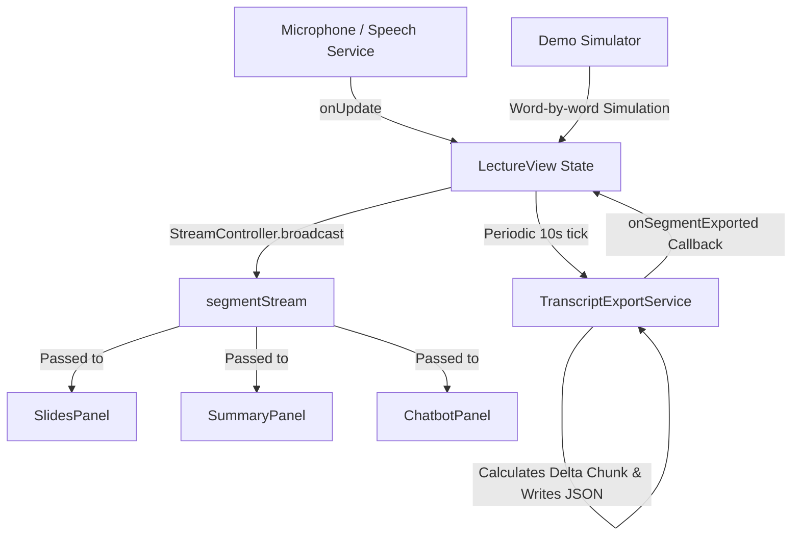

# Developer Guideline: Real-time Transcript Streaming Service

This document guides developers on how to consume and utilize the real-time transcript streaming service within the Lecture Note App. This service broadcasts transcript segments in real-time (every 10 seconds) during class recording or simulation, allowing other panels (such as AI Notes/Summary, Chatbot, and Slides) to perform dynamic, real-time updates.

---

## 1. Architectural Overview

The stream architecture is designed to decouple the speech input source (live microphone or demo simulated typing) from the consumer UI panels.



### Key Components
1. **`TranscriptExportService`**: Manages the 10-second tick intervals, writes local `seg_NNN.json` files containing only the newly transcribed delta text, and invokes `onSegmentExported`.
2. **`LectureView` (`_LectureViewState`)**: Manages the stream controller, instantiates the export service, feeds the speech service updates into the export service, and exposes a broadcast `Stream<Map<String, dynamic>>` (`segmentStream`) to individual panels.
3. **Consumers (`SummaryPanel`, `ChatbotPanel`, `SlidesPanel`)**: Widgets that receive the `segmentStream` property and subscribe to it to respond to text chunks dynamically.

---

## 2. Event Payload Schema

Each event emitted on the stream is a structured Map (`Map<String, dynamic>`) with the following fields:

| Field Name | Type | Description |
| :--- | :--- | :--- |
| `timestamp` | `String` | ISO 8601 UTC timestamp of the exported segment (e.g. `"2026-06-09T10:15:30.123Z"`). |
| `duration_seconds` | `int` | Length of the segment duration (always `10` seconds). |
| `segment_index` | `int` | Auto-incrementing, 1-based index representing the sequence number of the segment. |
| `text` | `String` | The delta text transcribed during this 10-second window. |
| `is_empty` | `bool` | `true` if no new speech was transcribed during this interval (i.e. `text` is empty). |

### Example Payload:
```json
{
  "timestamp": "2026-06-09T10:15:30.000Z",
  "duration_seconds": 10,
  "segment_index": 4,
  "text": "and we will discuss the basic principles of algorithms today.",
  "is_empty": false
}
```

---

## 3. Integration & Consumption Patterns

### Pattern A: Declarative UI Updates (using `StreamBuilder`)
Best for simple UI elements that only want to display the last received chunk or status directly in their widget tree without maintaining complex internal states.

```dart
import 'package:flutter/material.dart';

class SimpleStreamViewer extends StatelessWidget {
  final Stream<Map<String, dynamic>>? segmentStream;

  const SimpleStreamViewer({super.key, this.segmentStream});

  @override
  Widget build(BuildContext context) {
    return StreamBuilder<Map<String, dynamic>>(
      stream: segmentStream,
      builder: (context, snapshot) {
        if (snapshot.connectionState == ConnectionState.waiting) {
          return const Text("Waiting for lecture to start...");
        }
        if (snapshot.hasError) {
          return Text("Error: ${snapshot.error}");
        }
        if (!snapshot.hasData) {
          return const Text("No chunks received yet.");
        }

        final segment = snapshot.data!;
        final text = segment['text'] as String;
        final index = segment['segment_index'] as int;

        return Column(
          crossAxisAlignment: CrossAxisAlignment.start,
          children: [
            Text("Segment #$index:"),
            Text(
              text.isEmpty ? "(Silence)" : text,
              style: const TextStyle(fontWeight: FontWeight.bold),
            ),
          ],
        );
      },
    );
  }
}
```

---

### Pattern B: Stateful Subscription (Recommended for API integrations or complex states)
Best when you need to trigger asynchronous operations (like calling the Gemini API to update notes or chatbots) when a new chunk arrives, or when you need to manage local state collections.

> [!IMPORTANT]
> **Subscribing to a Stream in a Widget:**
> Always cancel your stream subscription in `dispose()` to avoid memory leaks. Also, implement `didUpdateWidget()` to clean up and re-subscribe if the widget's stream instance changes.

```dart
import 'dart:async';
import 'package:flutter/material.dart';

class InteractiveConsumerPanel extends StatefulWidget {
  final Stream<Map<String, dynamic>>? segmentStream;

  const InteractiveConsumerPanel({super.key, this.segmentStream});

  @override
  State<InteractiveConsumerPanel> createState() => _InteractiveConsumerPanelState();
}

class _InteractiveConsumerPanelState extends State<InteractiveConsumerPanel> {
  StreamSubscription<Map<String, dynamic>>? _subscription;
  final List<String> _receivedChunks = [];

  @override
  void initState() {
    super.initState();
    _subscribeToStream();
  }

  @override
  void didUpdateWidget(covariant InteractiveConsumerPanel oldWidget) {
    super.didUpdateWidget(oldWidget);
    // If the stream instance changed (e.g. session restarted), reset the subscription
    if (oldWidget.segmentStream != widget.segmentStream) {
      _unsubscribeFromStream();
      _subscribeToStream();
    }
  }

  @override
  void dispose() {
    _unsubscribeFromStream();
    super.dispose();
  }

  void _subscribeToStream() {
    if (widget.segmentStream == null) return;
    
    _subscription = widget.segmentStream!.listen(
      (segment) {
        final text = segment['text'] as String;
        final index = segment['segment_index'] as int;
        final isEmpty = segment['is_empty'] as bool;

        if (!isEmpty) {
          setState(() {
            _receivedChunks.add(text);
          });
          
          // --- Custom Logic Trigger Example ---
          _processChunkWithAI(index, text);
        }
      },
      onError: (err) {
        debugPrint("Stream error encountered: $err");
      },
    );
  }

  void _unsubscribeFromStream() {
    _subscription?.cancel();
    _subscription = null;
  }

  Future<void> _processChunkWithAI(int index, String text) async {
    // Implement API calls or local business logic here (e.g., query LLM)
    debugPrint("Processing chunk #$index for real-time summary update...");
  }

  @override
  Widget build(BuildContext context) {
    return ListView.builder(
      itemCount: _receivedChunks.length,
      itemBuilder: (context, idx) => ListTile(
        leading: CircleAvatar(child: Text("${idx + 1}")),
        title: Text(_receivedChunks[idx]),
      ),
    );
  }
}
```

---

## 4. Guidelines for Real-Time Feature Implementations

### AI Summary / Note Updates (`SummaryPanel`)
- When a new non-empty segment is received, you can accumulate the incoming text locally.
- Use a background debounced request to the Gemini API to update the summary for the active slide pages using the new transcript content.

### Chatbot Updates (`ChatbotPanel`)
- As transcripts stream in, they can be appended to the chatbot session's context.
- When the user asks a question, the chatbot can immediately search both the existing lecture slides and the newly compiled live transcript chunks.

### Slide Synchronization (`SlidesPanel`)
- Listen to segment chunks to see if specific slide numbers or page indices are mentioned (e.g. using keywords like *"now look at page five"*, or *"on slide six"*).
- Automatically sync slide viewports based on transcript context or keywords.

---

## 5. Testing & Mocking (Demo Mode)

For development and demonstration purposes, we support a mock typing simulation mode.
1. Enable **Demo Mode** in the **Transcript Panel** UI.
2. Click **Record** (microphone button).
3. The simulator will simulate word-by-word typing of a pre-recorded mock lecture.
4. Every 10 seconds, the simulator exports the accumulated typing progress into the exact same JSON format and dispatches it through the `segmentStream`.

This allows you to write, test, and verify your real-time processing components directly in the app without having to speak into your microphone or connect to live external servers!
